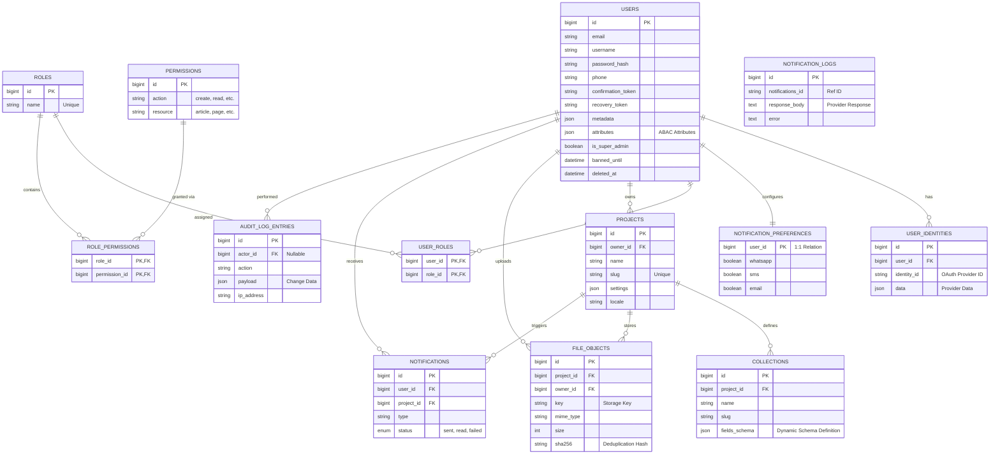

### Entity-Relationship Diagram (ERD)

---

## Architecture Documentation

### 1. Identity & User Management Module

This module handles the core identity lifecycle, supporting both local password authentication and OAuth strategies.

* **`users`**: A "Fat Model" table containing all security-critical state.
* **Security Features**: Includes fields for `otp_code` (2FA), `banned_until` (temporary suspension), and multiple token fields (`confirmation_token`, `recovery_token`, `reauthentication_token`) for secure flows.
* **Data Integrity**: The `confirmed_at` column is a generated column (`LEAST(email_confirmed_at, phone_confirmed_at)`), ensuring the confirmation status is always calculated at the database level.
* **Soft Deletes**: Supports `deleted_at` to maintain referential integrity for historical data.

* **`user_identities`**: Handles federated login (Google, GitHub, SSO). A single user can link multiple providers.
* **`notification_preferences`**: A strict 1:1 relationship allowing users to opt-in/out of specific communication channels (WhatsApp, SMS, Email).

### 2. Access Control (RBAC & ABAC)

The system implements a hybrid authorization model providing both structure and flexibility.

* **RBAC (Role-Based Access Control)**:
* Standard `users`  `roles`  `permissions` flow.
* Pivot tables (`user_roles`, `role_permissions`) use composite primary keys to strictly prevent duplicate assignments.

* **ABAC (Attribute-Based Access Control)**:
* The `users` table includes an **`attributes`** JSON column.
* **Use Case**: This allows fine-grained policies not possible with simple roles (e.g., *"User can only edit resources in 'Region: EU'"* or *"User spending limit is $500"*).

### 3. Multi-Tenancy & CMS (Projects)

The architecture is designed to host multiple isolated projects (tenants) within a single deployment.

* **`projects`**: The root entity for isolation. Contains global configurations (`settings`) and localization data (`locale`).
* **`collections`**: Defines dynamic data structures.
* **Schema-less Capability**: Uses `fields_schema` (JSON) to define the structure of the data (Title, Body, Image, etc.), effectively allowing the creation of custom content types at runtime without altering the database schema.

* **`file_objects`**: Centralized asset management.
* **Deduplication**: The `sha256` column allows for Content-Addressable Storage strategies (avoiding storing the same file twice).
* **Context**: Files are bound to a specific Project and the User who uploaded them.

### 4. Observability & System Logs

Tables dedicated to tracking system health, security, and user engagement.

* **`audit_log_entries`**: An immutable security log.
* Records **Who** (`actor_id`), **What** (`action`), **Where** (`ip_address`), and **Data Changed** (`payload`).
* Essential for compliance (SOC2, HIPAA, GDPR).

* **`notifications`**: The user-facing inbox of alerts/messages within the application.
* **`notification_logs`**: Technical logs for external delivery providers (Twilio, SendGrid, etc.). Stores request/response bodies to debug delivery failures.

### Key Technical Decisions

1. **JSON Usage**: Heavy reliance on `JSON` types (`settings`, `metadata`, `actions`, `fields_schema`) provides flexibility for features that change frequently, reducing the need for database migrations.
2. **Generated Columns**: Using computed columns for `confirmed_at` reduces logic errors in the application layer.
3. **Composite Keys**: Used effectively in pivot tables to enforce uniqueness and improve index performance.
4. **Separation of Concerns**: Notifications are split into "User Inbox" (`notifications`) and "Delivery Logs" (`notification_logs`), keeping user data clean from technical debugging data.
